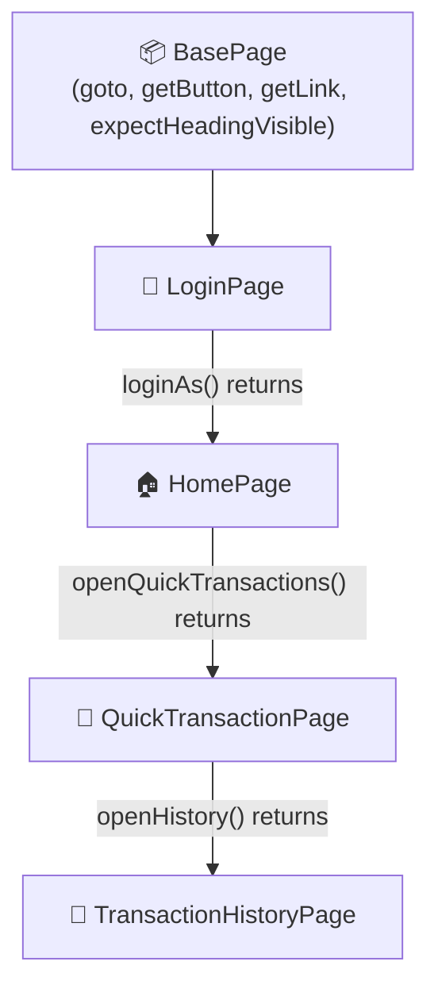
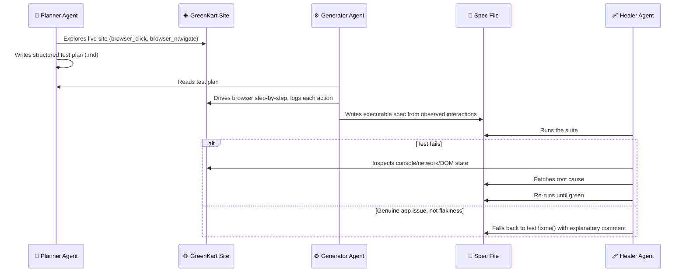

<p align="center">
  
</p>

<p align="center">
  
  
  
  
</p>

---

### 📋 Overview

This is a proof-of-concept showing how a small automation codebase can be structured for **maintainability from day one** — reusable page classes, config-driven test data, and defensive engineering against a flaky hosted test site.

It automates two independent applications, built two different ways:

| | Banking Demo | GreenKart Shop |
|---|---|---|
| **How it was built** | Hand-written, Page Object Model | AI-agent generated (planner → generator → healer) |
| **What it proves** | I can design a maintainable framework from scratch | I can direct AI agents and still own the resulting code |

> 🆕 **New here?** This README explains not just what each piece does, but *why it's built that way* — every "Engineering Detail" below is something worth bringing up in an interview.

---

### 🏗️ Architecture — Page Object Model



Each page method returns the **next page object** in the flow, so a test reads like a chained user journey instead of a wall of raw selectors:

```ts
const loginPage = new LoginPage(page);
await loginPage.open(config.url);

const homePage = await loginPage.loginAs(config.username, config.password, config.appName);
const quickTransactionPage = await homePage.openQuickTransactions();
const reference = await quickTransactionPage.createTransfer(transferTestData);

const historyPage = await quickTransactionPage.openHistory();
await historyPage.expectTransactionReference(reference);
```

> 💡 **What is a Page Object Model (POM)?** Instead of writing raw `page.click('#some-selector')` calls directly inside every test, each *page* of the app gets its own class holding its locators and actions. Tests then call readable methods (`loginAs(...)`, `openQuickTransactions()`) instead of raw selectors — so when the UI changes, you fix it in one place, not in every test that touches that page.

---

### 🔍 Engineering Details Worth Highlighting

<details open>
<summary><b>These are the decisions worth explaining in an interview — click any to expand</b></summary>

<br>

**⚙️ Config-driven, not hardcoded**
Target URL, login credentials, and app name live in `config.json`, not inline in test files — swapping environments doesn't touch test logic.

**📊 Data-driven test input**
The transfer amount/account/description come from `test-data/Transfer_TestData.json`, separating test data from test logic entirely.

**🏁 Race-condition-safe login**
`loginAs()` wraps the login click and the post-login `waitForURL` in a single `Promise.all`, so the navigation listener is attached **before** the click fires — this avoids a subtle, flaky bug where the page navigates before Playwright starts waiting for it.

**🛡️ Stability against a noisy demo site**
Tests abort network requests to YouTube/ad/tracking domains (`page.route(...).abort()`) that the hosted demo site pulls in, so ad/video loading noise doesn't cause flaky waits unrelated to the actual test.

**🔒 Single-worker execution — a deliberate trade-off**
Explained with a comment in the code itself: *"the hosted practice site is unstable when several browser sessions load it concurrently."* This is a documented decision, not an oversight — worth pointing out in review.

**🧮 Safe dynamic assertions**
The transaction reference (`TXN-123-456` style) is extracted at runtime via regex, then escaped with a static helper (`BasePage.escapeRegExp`) before being reused in a second regex match against transaction history — this avoids regex-injection bugs from dynamic string content, a subtle class of bug most beginner automation code doesn't guard against.

**🎥 Full failure artifacts on every run**
Screenshots (`fullPage: true`), video, and trace-on-retry are all enabled, so any failure is debuggable from the HTML report alone, without needing to reproduce it locally first.

</details>

---

### 🧰 Tech Stack

<p align="center">
  
</p>

| Layer | Choice |
|---|---|
| 🎭 Framework | Playwright Test (`@playwright/test`) |
| 🔷 Language | TypeScript |
| 🏗️ Pattern | Page Object Model |
| 📊 Reporting | Playwright HTML reporter |

---

### ✅ Test Coverage — Banking Flows

<details open>
<summary><b>💸 <code>banking-test.spec.ts</code> → "Verify Quick Transactions Flow"</b></summary>
<br>

**Step by step:**
1. Logs in with credentials from `config.json`
2. Opens the Quick Transactions section
3. Submits a transfer using data from `Transfer_TestData.json`
4. Confirms the transfer
5. Captures the generated transaction reference at runtime
6. Navigates to Transaction History
7. Asserts that exact reference appears in the history list

</details>

<details>
<summary><b>🧭 <code>banking-test.spec.ts</code> → "Verify transfer and bill payment tabs"</b></summary>
<br>

**Step by step:**
1. Logs in
2. Asserts the homepage loads correctly
3. Asserts the Transfers tab is visible
4. Asserts the Bill Payments tab is visible

</details>

<details>
<summary><b>🧾 <code>BillPayment.spec.ts</code> → Bill payment flow</b></summary>
<br>

**Step by step:**
1. Logs in
2. Navigates to Bill Payments
3. Submits a payment
4. Confirms the payment
5. Verifies the entry appears in Transaction History

*(Note: this spec is currently a Codegen-recorded script, not yet migrated to the POM style above — see Roadmap.)*

</details>

---

### 🤖 Test Coverage — GreenKart Shop (AI-Agent Generated)

A second, fully independent suite under `tests/green-kart/` targets the [GreenKart shop](https://www.green-kart.in/shop) — and it wasn't hand-written. It was produced by a **planner → generator → healer** agent workflow, wired into VS Code via a local Playwright MCP server.



All three agents run on **Claude Sonnet 4.6** through a local Playwright MCP server (`.vscode/mcp.json`). The key detail: the generator doesn't guess selectors from reading code — it **actually drives the browser** step-by-step and logs each real interaction before writing the spec, so the generated tests reflect observed behavior, not assumptions.

| Spec | Scenario |
|---|---|
| `verify-shop-page-loads.spec.ts` | Shop page loads, title/heading correct, product catalog renders |
| `filter-by-category.spec.ts` | Category filters (Fruits, Vegetables, Exotic, etc.) update the product grid correctly |
| `filter-by-price.spec.ts` | Price range filter narrows results, resets cleanly |
| `sort-products.spec.ts` | Sort by price (asc/desc) and name reorders the catalog correctly |
| `add-to-cart.spec.ts` | Adding products updates cart state and contents |
| `wishlist-compare.spec.ts` | Wishlist/compare controls work without breaking page state |
| `negative-edge-cases.spec.ts` | Invalid price ranges, repeated filter/sort combos, narrow viewports don't break the UI |

> 🎯 **Why this pairs well with the banking suite in an interview:** one shows hand-designed POM architecture from scratch; the other shows directing AI agents as a force-multiplier for test *planning and generation* — while still reviewing and owning the resulting code, including deciding when a failure is a real bug (`test.fixme()`) versus a flaky test worth fixing.

---

### 🚀 Getting Started

**Prerequisites:** [Node.js](https://nodejs.org/) (LTS) · npm · VS Code + GitHub Copilot *(optional — only needed to re-run the AI agents, not the existing tests)*

```bash
# 1. Clone and enter the repo
git clone https://github.com/vamsimappetti2001/Playwright-automation-Framework-POC.git
cd Playwright-automation-Framework-POC

# 2. Install dependencies
npm install

# 3. Install Playwright's browsers (one-time per machine)
npx playwright install

# 4. Run the full suite
npm test
```

```bash
# Interactive UI mode — watch each test step through the app visually
npm run test:ui

# View the HTML report from the last run
npm run report
```

---

### 📁 Project Structure

```
pages/
  BasePage.ts               # Shared locator/action primitives
  LoginPage.ts
  HomePage.ts
  QuickTransactionPage.ts
  TransactionHistoryPage.ts
tests/
  banking-test.spec.ts      # POM-based end-to-end flows
  BillPayment.spec.ts       # Bill payment flow (not yet migrated to POM)
  green-kart/                # AI-generated shop test suite
config.json                  # Target URL, credentials, app name
test-data/
  Transfer_TestData.json     # Externalized test input
specs/
  green-kart-shop-test-plan.md  # Planner agent's output
.github/agents/               # Planner/generator/healer agent definitions
.vscode/mcp.json              # Local Playwright MCP server config
playwright.config.ts
```

---

### 🗺️ Roadmap / Known Improvements

Being upfront about what's next, since that's a fair interview question:

- [ ] Refactor `BillPayment.spec.ts` into the same POM style as `banking-test.spec.ts` — it's currently a Codegen-recorded script
- [ ] Remove the default `example.spec.ts` and empty `seed.spec.ts` boilerplate left over from setup
- [ ] Migrate the GreenKart suite to page objects too, now that the AI-generated specs are in place
- [ ] Add a GitHub Actions workflow that actually **runs** the suite on push — `copilot-setup-steps.yml` currently only installs dependencies
- [ ] Move credentials out of `config.json` into environment variables — low risk since they're demo-site credentials, but it's the right habit
- [ ] Add `.playwright-mcp/` to `.gitignore` — its debug logs and page snapshots are currently committed

---

### 📖 Glossary

<details>
<summary><b>Click to expand — key terms used in this README</b></summary>
<br>

| Term | Meaning |
|---|---|
| **Page Object Model (POM)** | A pattern where each app page gets its own class holding locators/actions, so tests call readable methods instead of raw selectors |
| **Locator** | Playwright's way of finding an element on the page before interacting with it |
| **Race condition** | A bug where the outcome depends on timing — here, whether Playwright starts waiting for navigation before or after the click fires |
| **Regex-injection** | A bug where untrusted dynamic text is used to build a regex pattern without escaping special characters first, causing incorrect matches |
| **`test.fixme()`** | Playwright's way of marking a test as "known broken, skip for now" with a reason — used instead of deleting or ignoring the failure |
| **MCP (Model Context Protocol)** | An open protocol that lets an AI agent call real tools (like browser actions or test runners) instead of just generating text |

</details>

---

### 💡 Why This Project

Built to practice designing a test framework the way a real QA team would maintain one — page objects that model the app rather than the test, config/data separated from logic, explicit handling for a real flakiness source instead of blind retries, and a second suite that shows the same rigor applied to AI-agent-generated code.

---

### 👤 Author

**Vamsi Mappetti** · QA / Test Automation Engineer
📍 Bengaluru, India &nbsp;|&nbsp; 🔗 [@vamsimappetti2001](https://github.com/vamsimappetti2001)


